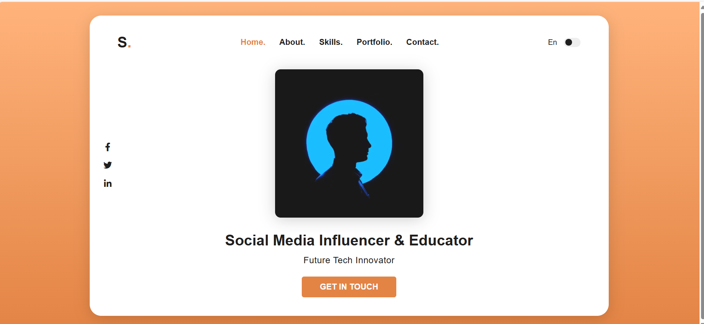

  
  
  
  
  
  

   
   
  
  

  <h2 align="center">Shubham - Personal portfolio</h2>

  This website is fully responsive personal portfolio,  Responsive for all devices, built using HTML, CSS, and JavaScript.

  <a href="https://techindro.github.io/shubham-portfolio/"><strong>➥ Live Demo</strong></a>

 

### Demo Screenshots

### Prerequisites

Before you begin, ensure you have met the following requirements:

* [Git](https://git-scm.com/downloads "Download Git") must be installed on your operating system.

### Run Locally

To run **shubham-portfolio** locally, run this command on your git bash:

Linux and macOS:

If you want to contact with me you can reach me at [Twitter](https://www.twitter.com/codewithsadee).

### License

This project is **free to use** and does not contains any license.

